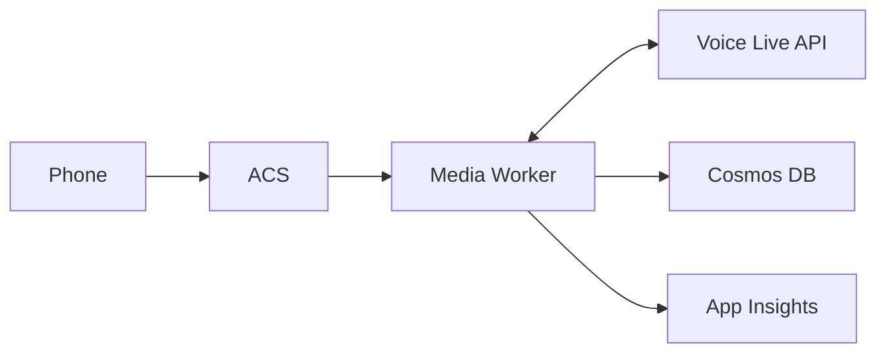

# Botel AI Real-Time Voice SDR Agent

A low-latency outbound voice agent built on Azure that books demos for short-term rental (STR) operators. This solution leverages Azure Communication Services, Azure AI Speech, and Azure OpenAI to create a natural conversational experience with sub-700ms response times.

## 🏗️ Architecture

### Clean Voice Live Architecture

With Voice Live API, we've simplified from 10+ services to just 6 core services:



**Core Services:**
- **Voice Live API**: All-in-one voice processing (STT + GPT-4o + TTS)
- **Azure Communication Services**: Phone number management
- **Container Apps**: Hosts the media worker
- **Cosmos DB**: Conversation storage
- **Key Vault**: Secure secrets (only 3 needed!)
- **Application Insights**: Monitoring

See [Infrastructure Overview](docs/infrastructure-overview.md) for details.

## 🚀 Voice Live API Option (Recommended)

This project supports Azure's new [Voice Live API](https://learn.microsoft.com/en-us/azure/ai-services/speech-service/voice-live) which provides:

- **50% lower latency** (300-500ms vs 600-900ms)
- **Built-in audio processing** (noise suppression, echo cancellation)
- **Simplified architecture** (single WebSocket instead of multiple services)
- **Native interruption handling** for natural conversations

The project is configured to deploy all resources to **East US 2** for optimal performance with Voice Live API.

To deploy:
```powershell
cd infra
.\deploy.ps1 -Environment dev -Location eastus2
```

See [Voice Live Analysis](docs/voice-live-api-analysis.md) for detailed comparison.

## 🚀 Quick Start

### Prerequisites

- Azure subscription with appropriate permissions
- Azure CLI (version 2.50.0+)
- Node.js 20+ and npm
- Docker Desktop (for container builds)
- PowerShell 7+ or Bash

### Infrastructure Deployment

1. **Clone the repository**
   ```bash
   git clone https://github.com/your-org/botel-ai-voice-agent.git
   cd botel-ai-voice-agent
   ```

2. **Login to Azure**
   ```bash
   az login
   ```

3. **Deploy infrastructure**
   
   **Windows (PowerShell):**
   ```powershell
   cd infra
   .\deploy.ps1 -Environment dev -Location eastus2
   ```
   
   **Linux/Mac (Bash):**
   ```bash
   cd infra
   chmod +x deploy.sh
   ./deploy.sh --environment dev --location eastus2
   ```

4. **Note the deployment outputs** - especially the Resource Group name, Key Vault name, and Container App URL.

## 📁 Project Structure

```
/
├── infra/                    # Infrastructure as Code (Bicep)
│   ├── main.bicep           # Main orchestration template
│   ├── modules/             # Individual resource modules
│   ├── deploy.ps1           # Windows deployment script
│   └── deploy.sh            # Linux/Mac deployment script
├── media-worker/            # Node.js media processing service
│   ├── src/                 # Source code
│   └── tests/               # Unit and integration tests
├── agent/                   # AI agent configuration
│   └── tools/              # Function calling definitions
└── shared/                  # Shared TypeScript types and utilities
```

## 🔧 Development Setup

### Media Worker Development

1. **Navigate to media-worker directory**
   ```bash
   cd media-worker
   ```

2. **Install dependencies**
   ```bash
   npm install
   ```

3. **Set up environment variables**
   ```bash
   cp .env.example .env
   # Edit .env with your Azure resource values
   ```

4. **Run locally**
   ```bash
   npm run dev
   ```

5. **Run tests**
   ```bash
   npm test           # Unit tests
   npm run test:e2e   # End-to-end tests
   ```

### Building & Deploying

1. **Build Docker image**
   ```bash
   docker build -t ghcr.io/your-org/media-worker:latest .
   ```

2. **Push to registry**
   ```bash
   docker push ghcr.io/your-org/media-worker:latest
   ```

3. **Update Container App** (automatic via CI/CD or manual)
   ```bash
   az containerapp update \
     --name ca-media-worker-dev \
     --resource-group rg-botel-voice-dev \
     --image ghcr.io/your-org/media-worker:latest
   ```

## 🎯 Performance Targets

With Voice Live API deployment in East US 2:

| Metric | Target | Measurement |
|--------|--------|-------------|
| Round-trip time (RTT) | < 500ms (95th percentile) | `roundTripLatency` in App Insights |
| STT first token | < 150ms | Built into Voice Live |
| TTS first byte | < 200ms | Built into Voice Live |
| Call capacity | 1,000 calls/day | Load test validation |
| Cost per minute | < $0.025 | Azure Cost Management |
| Audio quality | > 4.5/5 | Built-in noise suppression & echo cancellation |

See the [Voice Live Deployment Guide](docs/deployment-guide-voice-live.md) for detailed setup instructions.

## 🔒 Security & Compliance

- **GDPR compliant** data handling
- **End-to-end encryption** for all communications
- **Azure Key Vault** for secrets management
- **Managed identities** for service-to-service auth
- **No hardcoded credentials** in code or config

### 🔐 Automated Secrets Management

**Zero manual configuration required!** All secrets are automatically:
- Retrieved from Azure services during deployment
- Stored securely in Azure Key Vault
- Accessed by Container Apps using managed identity

See [Automated Secrets Guide](docs/automated-secrets-guide.md) for details.

### GDPR Data Flow

1. **Audio Stream**: Temporary processing only, not persisted
2. **Transcriptions**: Stored in Cosmos DB with encryption
3. **Call Metadata**: Anonymized after 30 days
4. **User Consent**: Obtained at call start

## 📊 Monitoring & Observability

Access the Voice Agent Performance Dashboard in Azure Portal:
1. Navigate to your Application Insights resource
2. Open "Workbooks" from the left menu
3. Select "Voice Agent Performance Dashboard"

Key metrics tracked:
- Call volume and success rate
- Latency percentiles (P50, P95, P99)
- Speech recognition accuracy
- Agent response quality
- Cost per conversation

## 🧪 Testing

### Manual Testing

1. **Get test phone number from ACS**
   ```bash
   az communication phonenumber list \
     --connection-string "<ACS_CONNECTION_STRING>"
   ```

2. **Make test call**
   - Call the provisioned number
   - Follow the voice prompts
   - Test booking a demo

### Load Testing

```bash
cd tests/load
k6 run voice-agent-load-test.js
```

## 🚁 CI/CD Pipeline

GitHub Actions workflow (`.github/workflows/deploy.yml`) handles:
1. Code linting and formatting checks
2. Unit test execution
3. Container image build
4. Deployment to test environment
5. Integration test execution
6. Production deployment (manual approval)

## 🔍 Troubleshooting

### Common Issues

1. **High latency (>700ms RTT)**
   - Check Speech service region matches deployment region
   - Verify WebSocket connection stability
   - Review Application Insights for bottlenecks

2. **Speech recognition errors**
   - Ensure audio format is 16kHz, 16-bit PCM
   - Check for background noise in audio stream
   - Verify Speech service quota limits

3. **Container App not starting**
   - Check container logs: `az containerapp logs show`
   - Verify all environment variables are set
   - Ensure Key Vault access policies are configured

### Debug Commands

```bash
# View container logs
az containerapp logs show \
  --name ca-media-worker-dev \
  --resource-group rg-botel-voice-dev \
  --follow

# Check Key Vault secrets
az keyvault secret list \
  --vault-name kv-botel-voice-dev

# Monitor real-time metrics
az monitor metrics list \
  --resource <resource-id> \
  --metric-names "roundTripLatency"
```

## 📚 Additional Resources

- [Azure Communication Services Docs](https://docs.microsoft.com/azure/communication-services/)
- [Azure AI Speech SDK](https://docs.microsoft.com/azure/cognitive-services/speech-service/)
- [Azure OpenAI Service](https://docs.microsoft.com/azure/cognitive-services/openai/)
- [Container Apps Documentation](https://docs.microsoft.com/azure/container-apps/)

## 🤝 Contributing

1. Fork the repository
2. Create a feature branch (`git checkout -b feature/amazing-feature`)
3. Commit changes (`git commit -m 'Add amazing feature'`)
4. Push to branch (`git push origin feature/amazing-feature`)
5. Open a Pull Request

## 📄 License

This project is proprietary to Botel AI. All rights reserved. # Fresh deployment with v3 infrastructure - 06/05/2025 22:49:51
