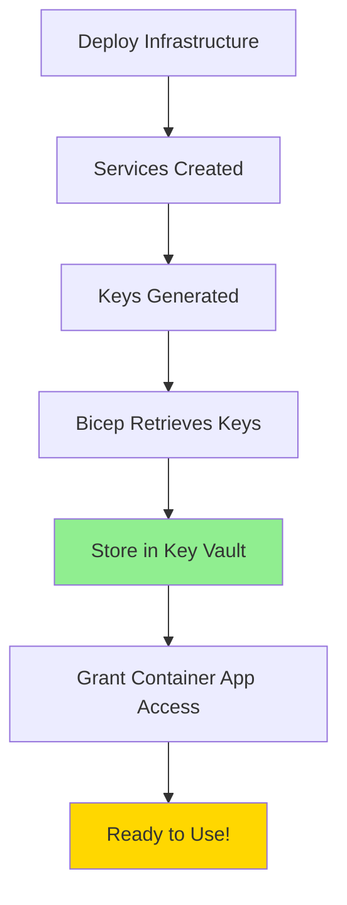

# 🔐 Automated Secrets Management

## Zero Manual Configuration Required!

With our Voice Live API infrastructure, all secrets are automatically retrieved and stored in Azure Key Vault during deployment. You don't need to manually copy or configure any secrets.

## 🤖 What Happens Automatically

### During Deployment

1. **Infrastructure Creation**
   - Azure creates all services (ACS, Speech, Cosmos DB)
   - Each service generates its own access keys/connection strings

2. **Automatic Secret Retrieval**
   - Bicep templates automatically fetch:
     - ACS connection string from Communication Services
     - Speech service key from Speech Services
     - Cosmos DB primary key from Cosmos account

3. **Secure Storage**
   - All secrets are stored in Azure Key Vault
   - System prompt for the AI agent is also stored
   - No secrets are exposed in logs or outputs

4. **Access Configuration**
   - Container App gets a managed identity
   - Automatic RBAC role assignment for Key Vault access
   - Container App can read secrets without storing credentials

## 🔑 Secrets Stored Automatically

| Secret Name | Source | Used For |
|-------------|--------|----------|
| `acs-connection-string` | Azure Communication Services | Phone number management |
| `speech-key` | Azure Speech Services | Voice Live API access |
| `cosmos-key` | Cosmos DB | Database operations |
| `agent-system-prompt` | Deployment template | AI agent personality |

## 📊 Deployment Output

When you run the deployment script, you'll see:

```
🔐 Verifying secrets in Key Vault...
✅ Secret 'acs-connection-string' is stored in Key Vault
✅ Secret 'speech-key' is stored in Key Vault
✅ Secret 'cosmos-key' is stored in Key Vault
✅ Secret 'agent-system-prompt' is stored in Key Vault

✅ All secrets successfully stored in Key Vault!
No manual configuration needed - everything is automated! 🎉
```

## 🏗️ Architecture Flow



## 🛡️ Security Features

1. **RBAC Authorization**
   - Key Vault uses Azure RBAC (not access policies)
   - More secure and auditable

2. **Managed Identity**
   - Container App uses system-assigned identity
   - No credentials in code or config

3. **Least Privilege**
   - Container App only has "Key Vault Secrets User" role
   - Can read secrets but not modify them

4. **Soft Delete Protection**
   - 90-day retention for deleted secrets
   - Purge protection enabled

## 🚀 How Container App Uses Secrets

The Container App configuration automatically references Key Vault:

```bicep
secrets: [
  {
    name: 'acs-connection-string'
    keyVaultUrl: '${keyVault.vaultUri}secrets/acs-connection-string'
    identity: 'system'
  }
  // ... other secrets
]
```

Environment variables reference these secrets:
```bicep
{
  name: 'ACS_CONNECTION_STRING'
  secretRef: 'acs-connection-string'
}
```

## 🔍 Verify Secret Access (Optional)

If you want to verify the Container App can access secrets:

```bash
# Get Container App logs
az containerapp logs show \
  --name ca-media-worker-dev \
  --resource-group rg-botel-voice-dev \
  --follow

# Look for successful initialization messages
```

## 📝 Updating Secrets

To update a secret (e.g., system prompt):

```bash
# Update the agent system prompt
az keyvault secret set \
  --vault-name kv-botel-voice-dev-xxxxx \
  --name "agent-system-prompt" \
  --value "Your new prompt here..."

# Restart Container App to pick up changes
az containerapp revision restart \
  --name ca-media-worker-dev \
  --resource-group rg-botel-voice-dev
```

## ✨ Benefits

1. **Zero Manual Steps**
   - Deploy once, everything configured
   - No copy-paste of connection strings

2. **Secure by Default**
   - Secrets never exposed
   - Automatic rotation support

3. **Easy Updates**
   - Change secrets in Key Vault
   - Container App picks up changes

4. **Audit Trail**
   - All secret access logged
   - Compliance-ready

---

**Bottom Line**: Just run the deployment script and everything is configured automatically. No manual secret management required! 🎉 