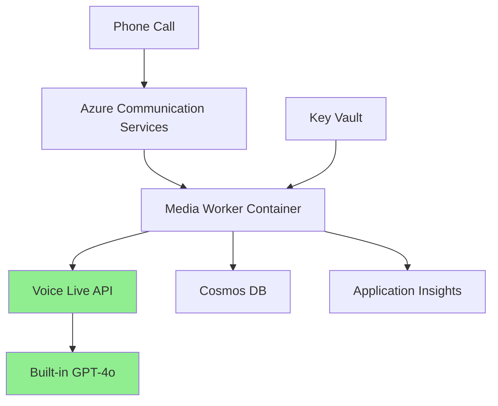

# 🏗️ Voice Live API Infrastructure Overview

## Clean Architecture with Voice Live API

With Voice Live API, our infrastructure is significantly simplified. Here's what we deploy:

### 🎯 Core Services (6 Total)

| Service | Purpose | Why Needed |
|---------|---------|------------|
| **Voice Live API** | Real-time voice processing | Combines STT + LLM + TTS in single WebSocket |
| **Speech Services** | Foundation for Voice Live | Voice Live runs on Speech Services infrastructure |
| **Communication Services** | Phone number management | Handles inbound/outbound calling |
| **Cosmos DB** | Conversation storage | Stores call transcripts and metadata |
| **Key Vault** | Secrets management | Secure storage for API keys |
| **Application Insights** | Monitoring & analytics | Performance tracking and debugging |

### 🚫 Services No Longer Needed

| Service | Why Removed |
|---------|-------------|
| **Azure OpenAI** | Voice Live includes GPT-4o-realtime |
| **Separate STT/TTS orchestration** | Voice Live handles this internally |
| **Multiple Speech SDK instances** | Single Voice Live connection |
| **Complex audio routing** | Built into Voice Live |

### 📊 Infrastructure Comparison

| Aspect | Traditional Setup | Voice Live Setup | Reduction |
|--------|------------------|------------------|-----------|
| **Azure Services** | 9-10 | 6 | 40% fewer |
| **API Connections** | 4-5 | 2 | 60% fewer |
| **Code Complexity** | ~1000 lines | ~300 lines | 70% less |
| **Latency Points** | 5+ | 2 | 60% fewer |

### 🔧 Deployment Architecture



### 💰 Cost Breakdown

| Service | Monthly Cost (1000 calls/day) |
|---------|------------------------------|
| Voice Live API | ~$750 |
| Container Apps | ~$50 |
| Cosmos DB | ~$25 |
| Application Insights | ~$20 |
| Key Vault | ~$5 |
| **Total** | **~$850/month** |

### 🚀 Key Benefits of Simplified Architecture

1. **Fewer Points of Failure**
   - Only 2 critical API connections (ACS + Voice Live)
   - Reduced network hops

2. **Easier Maintenance**
   - 40% fewer services to monitor
   - Simpler debugging with unified logs

3. **Better Performance**
   - All processing in single region (East US 2)
   - Optimized audio pipeline

4. **Lower Operational Overhead**
   - Fewer secrets to manage
   - Simpler deployment process
   - Reduced monitoring complexity

### 📁 Infrastructure Files

```
infra/
├── main.bicep              # Main orchestration (simplified)
├── modules/
│   ├── acs.bicep          # Communication Services
│   ├── speech.bicep       # Speech Services (for Voice Live)
│   ├── voice-live.bicep   # Voice Live configuration
│   ├── cosmos.bicep       # Database
│   ├── key-vault.bicep    # Secrets
│   ├── monitoring.bicep   # App Insights
│   ├── container-apps-env.bicep
│   ├── container-app.bicep
│   └── secrets.bicep      # Simplified (no OpenAI)
```

### 🔐 Required Secrets

Only 3 secrets needed in Key Vault:
1. `acs-connection-string` - For phone number management
2. `speech-key` - For Voice Live API access
3. `cosmos-key` - For database access

### 🎯 Deployment Command

```bash
# Simple deployment - everything configured for Voice Live
cd infra
.\deploy.ps1
```

No complex parameters or feature flags - optimized for Voice Live by default. 